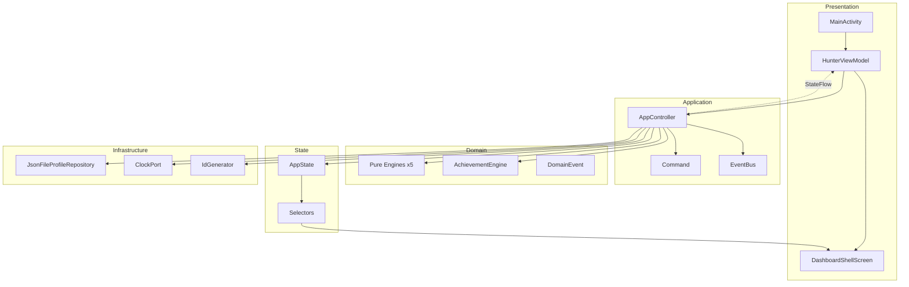

# Hunter System — Master Project State

> **Last verified:** Repository inspection, August 2026. Re-verify against code before acting on any claim.

---

## Product Identity

| Field | Value |
|-------|-------|
| **Name** | Hunter System |
| **Platform** | Android (local-first) |
| **Application ID** | `com.aistudio.huntersystem.qvrz` |
| **Namespace** | `com.example` |
| **Version** | 1.0 (versionCode 1) |

**Vision (from repository evidence):** A Solo Leveling–inspired gamified habit and task system. Users act as a "Hunter" who receives quest directives, earns XP and gold, levels up through ranks (E→S), maintains daily streaks, and unlocks achievements. Described in `metadata.json` as: *"Solo Leveling inspired gamified habit and task system with rank progression, streak tracking, and daily cycles."*

**Android goal:** Single-screen dashboard app with offline JSON persistence. No network dependency in Kotlin source. `metadata.json` references a Gemini API capability — **no Gemini implementation exists in the codebase.**

---

## Current Architecture (Summary)

**Pattern:** Command-driven, mutex-guarded transactions. Pure domain engines compute transitions. `AppState` is the single in-memory source of truth. Persistence gates memory commit and event publication.

---

## Completed Phases

| Phase | Status | Evidence |
|-------|--------|----------|
| Step 2 — Core Architecture | **COMPLETE** | `AppController`, `AppState`, `Command`, `EventBus`, `ProfileRepository`, `JsonFileProfileRepository`, `ClockPort`, `Selectors` |
| Step 3 — Quest Domain | **COMPLETE** | Quest model, 7 commands, UI board, `QuestDomainTest.kt` |
| Step 4 — Progression | **COMPLETE** | `ProgressionEngine`, `GainXp`, `ProgressionSystemTest.kt` |
| Step 5 — Daily + Streak | **COMPLETE** | `DailyEngine`, `StreakEngine`, `ResolveDailyCycle`, `DailyStreakSystemTest.kt` |
| Step 6 — Reward & Economy | **COMPLETE** | `RewardEngine`, gold commands, `RewardEconomySystemTest.kt` |
| Step 7 — Achievements | **COMPLETE** | `AchievementEngine`, catalog (7 defs), UI card, `AchievementSystemTest.kt` |
| Step 8.0 — MVP Readiness Audit | **PARTIALLY STARTED** | UI diagnostic/verification cards; no audit docs until this pass; no productization |

---

## Current Feature Set

**User can:**
- View hunter profile, level, XP bar, rank, gold, daily stats, streak
- Create quests (4 tiers: E/N/H/S) with optional description
- Filter quest board (ALL / ACTIVE / PENDING / COMPLETED)
- Start, complete, fail, cancel, delete quests
- View achievements (7 milestones, locked/unlocked)
- Reset profile and update display name (verification controls)
- View architecture diagnostics (schema version, revision, quest counts)

**User cannot (not implemented):**
- Navigate to multiple screens
- Change settings via UI (`UpdateSettings` command exists, no UI)
- Onboarding flow
- Due-date UI (model supports `dueDate`, creation UI does not expose it)
- Streak shields (`shieldCount` in model, unused)
- Cloud sync, AI/Gemini integration

---

## State Model

Single `AppState` containing: `profile`, `progression`, `quests`, `streak`, `daily`, `achievements`, `settings`, `metadata`, `schemaVersion`.

See `ARCHITECTURE.md` for field-level ownership.

---

## Persistence Model

- **Technology:** Moshi JSON serialization
- **File:** `{filesDir}/hunter_system_profile_v1.json`
- **Backup:** `.bak` file on each save
- **Atomic writes:** temp file → rename/copy
- **Recovery:** backup → default state fallback

---

## Current UI

- **Entry:** `MainActivity` → `HunterViewModel` → `DashboardShellScreen`
- **Theme:** `HunterSystemTheme` (dark Solo Leveling aesthetic)
- **Screens:** 1 (dashboard only)
- **Legacy unused:** `com.example.ui.theme.*` (Android Studio template)

---

## Test State

| Metric | Value |
|--------|-------|
| Unit test files | 13 |
| `@Test` count (unit) | 77 |
| Instrumented tests | 1 |
| **Total test methods** | **78** |
| Execution in this environment | **NOT EXECUTED** (no `gradlew` wrapper in repo) |

See `TEST_STATUS.md` for breakdown.

---

## Build State

| Item | Status |
|------|--------|
| Gradle config | Present (`build.gradle.kts`, `libs.versions.toml`) |
| Gradle wrapper scripts | **MISSING** (`gradlew` / `gradlew.bat` not in repo) |
| Compose | Enabled |
| Debug/release signing | Configured in `app/build.gradle.kts` |
| Build execution | **NOT VERIFIED** |

---

## Current MVP State

**Functional MVP core:** Domain systems (quest, progression, daily, streak, economy, achievements) are implemented with substantial test coverage in source.

**Not MVP-ready for release:**
- No onboarding
- No settings UI
- Single scrollable dashboard (developer/verification oriented)
- Legacy boilerplate tests and unused theme package
- No verified CI/build execution in repo
- No user-facing polish pass completed

---

## Current Phase

**Between Step 7 (complete) and Step 8.0 (partially started).**

Immediate work: complete Step 8.0 MVP Readiness / Productization Audit (documentation-first, then gap assessment).

---

## Immediate Next Task

See `NEXT_TASK.md` — **Step 8.0 MVP Readiness / Productization Audit** (audit only; no feature implementation).

---

## Known Risks

1. **Tests not executed** — 78 tests exist; execution unverified in this environment
2. **No Gradle wrapper** — `./gradlew` scripts absent; build requires local Gradle setup or wrapper generation
3. **Rank field drift** — `progression.rank` stored and derivable from level; not reconciled on load
4. **`shieldCount` unused** — reserved field with no engine logic
5. **`StreakChanged` event never emitted** — dead event type in `DomainEvent`
6. **Legacy code** — `com.example.ui.theme`, example tests may confuse future agents
7. **`metadata.json` Gemini reference** — aspirational; no implementation

---

## Architectural Invariants (Do Not Break)

1. All state mutations go through `AppController.dispatch()`
2. Domain engines remain pure (no I/O, no state mutation)
3. Persist before committing memory and emitting events
4. `AppState` is immutable — transitions via `.copy()`
5. `EventBus` publishes facts, not commands
6. Use `ClockPort` for "now" in application layer (tests use `TestClockPort`)
7. Do not create duplicate sources of truth without explicit authorization
